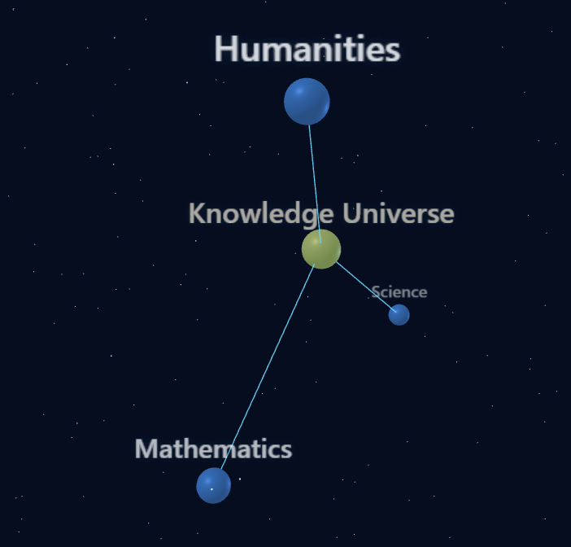

# Knowledge Universe Mapper

Single-user knowledge graph explorer with interactive 3D navigation.



## Features

- Left click a node to view details in sidebar.
- Double click a node to zoom in (node becomes the next universe center).
- Right click anywhere in scene to zoom out.
- Orbit/pan/zoom camera in 3D.
- Search nodes by label, description, or metadata.
- Add nodes with custom JSON metadata and multiple parents.
- Add arbitrary connections across levels with strength.
- Hierarchy cycle prevention for DAG integrity.
- Local persistence between sessions.

## Development

1. Install dependencies:

```bash
npm install
```

2. Run web development mode:

```bash
npm run dev
```

3. Run desktop development mode:

```bash
npm run desktop:dev
```

## Build

Web build:

```bash
npm run build
```

Windows installer build:

```bash
npm run desktop:build:win
```

Portable Windows executable build:

```bash
npm run desktop:build:portable
```

Output artifacts are generated in `dist/`.

## Non-technical laptop distribution

For users without Node.js:

1. Build installer/exe on a development machine once.
2. Share the produced `.exe` from `dist/`.
3. End user runs installer or portable exe directly.

No Node.js is required on end-user machines.
